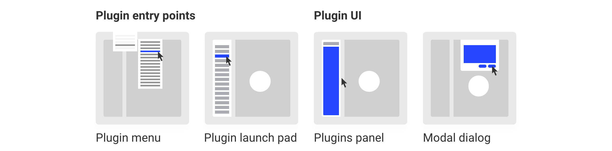

---
keywords:
  - Creative Cloud
  - API Documentation
  - UXP
  - Plugin
---

<InlineAlert variant="warning" slots="header, text1, text2, text3" />

Important Changes for XD Plugin Distribution in the Marketplace

On November 15th, 2024, we will stop accepting <i>new</i> plugins for Adobe XD in [our Marketplace](http://exchange.adobe.com/creativecloud). 

Existing published plugins can continue to be managed and updated via the Developer Distribution portal. The UXP Developer Tool (UDT) will continue to support plugin development. 

Visit the [FAQs](https://developer.adobe.com/xd/uxp/faq/) page for more details and refer to [this document](https://helpx.adobe.com/in/support/xd.html) for the overall plans for Adobe XD. 

      

# Designing a plugin experience

These guidelines will help you define the best user experience for your plugin. Based on your users workflow and the plugin action, different UX and UI patterns should be considered as you create a plugin.

Plugins can interact with the user at different levels, for example, some plugins will have quick actions which in some use cases won’t render UI, and some will include multiple actions that need UI. 

----------
 
## Plugins in XD

**Learn more about the types of Adobe XD plugins you can build.**

| **Plugins Panel**   | **Modal Dialog**   |
|---------------------------------------|----------------------------------|
| Non-Blocking UI - this surface is best used when the user should have access to the canvas while using the plugin.   | Blocking UI - this surface is best used when the plugin needs to run an action and the user shouldn’t modify or change selection of objects on the canvas.   | 

## UX Patterns

User Experience patterns will provide guidence on how to interact with your plugin users within XD, this will highlight UX requirements and best practices.

[View UX Patterns](ux-patterns/)

 
## User Interface

UI Resources will have information on UI components, examples and a sticker sheet you can use to build your plugin 

[View User Interface](user-interface/)