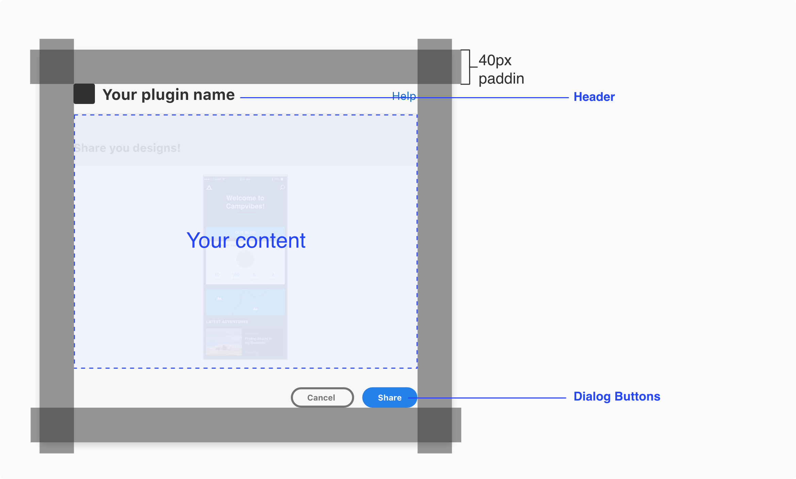
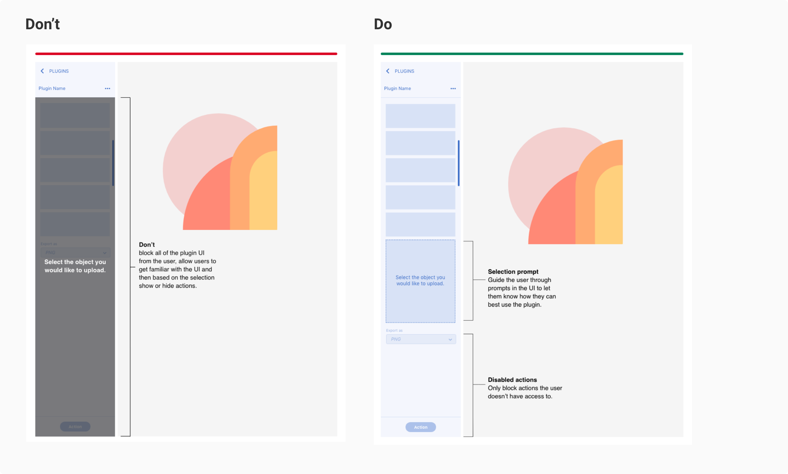

---
keywords:
  - Creative Cloud
  - API Documentation
  - UXP
  - Plugin
---

# UX Patterns

UX Patterns will include UX requirements and/or UX best practices these will ensure your plugin follows XD user experience patterns.

[Panel UX](/design/ux-patterns/panel-ux/)

[Modal UX](/design/ux-patterns/modal-ux/)

[Onboarding](/design/ux-patterns/onboarding/)

[Navigation](/design/ux-patterns/navigation/)

[Messaging](/design/ux-patterns/messaging/)

[Branding](/design/ux-patterns/branding/)

----------

  
 
## Documentation

#### UX Requirements

Requirements highlight key XD patterns all plugins need to follow to get approved by Adobe. 

#### Best practices

Best practices provide recommendations on plugin usability and behavior, user feedback, privacy, and interface guidelines. 

