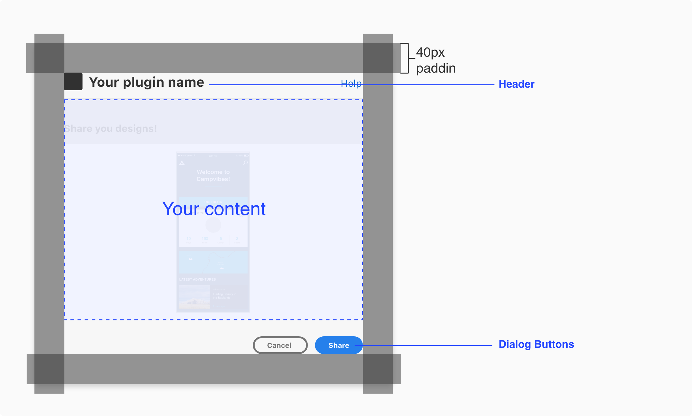
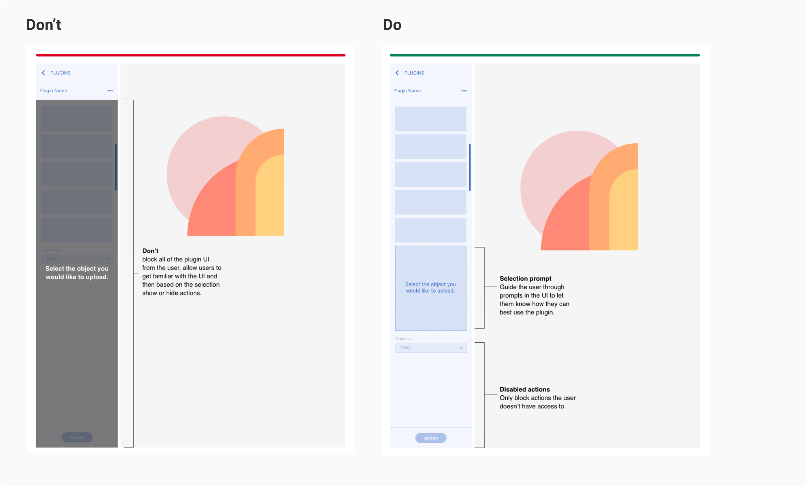

# UX Patterns

UX Patterns will include UX requirements and/or UX best practices these will ensure your plugin follows XD user experience patterns.

[Panel UX](/design/ux-patterns/panel-ux.md)

[Modal UX](/design/ux-patterns/modal-ux.md)

[Onboarding](/design/ux-patterns/onboarding.md)

[Navigation](/design/ux-patterns/navigation.md)

[Messaging](/design/ux-patterns/messaging.md)

[Branding](/design/ux-patterns/branding.md)

<HorizontalLine />
 \<br/\>
 
## Documentation

#### UX Requirements

Requirements highlight key XD patterns all plugins need to follow to get approved by Adobe. 

#### Best practices

Best practices provide recommendations on plugin usability and behavior, user feedback, privacy, and interface guidelines. 

