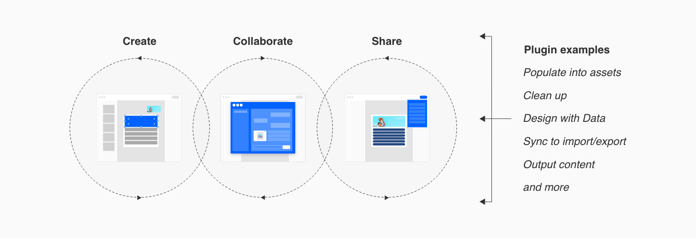

---
keywords:
  - Creative Cloud
  - API Documentation
  - UXP
  - Plugin
---

<InlineAlert variant="warning" slots="header, text1, text2, text3" />

Important Changes for XD Plugin Distribution in the Marketplace

We are no longer accepting <i>new</i> plugins for Adobe XD in [our Marketplace](http://exchange.adobe.com/creativecloud). 

Existing published plugins can continue to be managed and updated via the Developer Distribution portal. The UXP Developer Tool (UDT) will continue to support plugin development. 

Visit the [FAQs](https://developer.adobe.com/xd/uxp/faq/) page for more details and refer to [this document](https://helpx.adobe.com/in/support/xd.html) for the overall plans for Adobe XD. 

       

# Develop

XD plugins extend the capabilities of [Adobe XD](https://www.adobe.com/products/xd.html) by adding new features to the app, automating workflows, connecting the app to external services, and more.

On this page, we'll give you a quick overview of **what you can build** and **how to get started**.

From there, you can **choose your own adventure**: build a "Hello, World" plugin in our [Quick Start tutorial](/develop/tutorials/quick-start/), follow our [tutorials](/develop/tutorials/), try code-complete [sample plugins](https://github.com/AdobeXD/plugin-samples), or browse the [API references](/develop/reference/how-to-read/).

Oh, and be sure to [join the developer community](/community/) while you're here! We want you to say hi (we'll say hi back).

Now, let’s supercharge the future of design together with XD plugins!

## What can you build?

Plugins can be **tools** that help users create or automate their workflow, they can streamline collaboration by allowing users to **import** and **export**, and they can also provide users with external **information**.

The XD plugin APIs enable you to build plugins for a number of use cases, to help you get started here are three points to think about.

1. **The plugin workflow** - Identify the user stories for your plugin
2. **Key plugin action** - What are the key interactions for you plugin that would be valuable to your users
3. **Entry point and UI for your plugin in XD** - consider the user's intention in XD when interacting with your plugin

### User's workflow in XD

## Getting Started

There are lots of ways to journey through the documentation on your way to building the next great XD plugin. If you're just getting started, we recommend following the left-hand navigation on this site from top to bottom (or until you're ready to plot your own course!), and then proceed through the top-level navigation from left to right.

Here are some highlights you won't want to miss:

1. **Get Started**: To begin, try our [Quick Start tutorial](/develop/tutorials/quick-start/), then follow along with [the API feature tutorials](/develop/tutorials/).
1. **Go deep**: Learn more about how to build an XD plugin by reading [the plugin development 101](/develop/plugin-development/) and then dig into the [API reference](/develop/reference/).
1. **See code**: If you prefer to learn from working code, we have a [samples repo on GitHub](https://github.com/AdobeXD/Plugin-Samples) for you to take a look at.