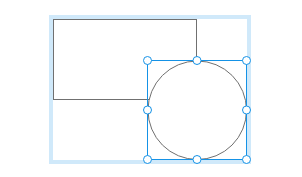
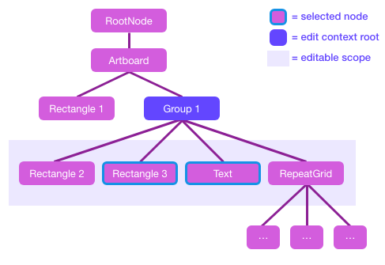
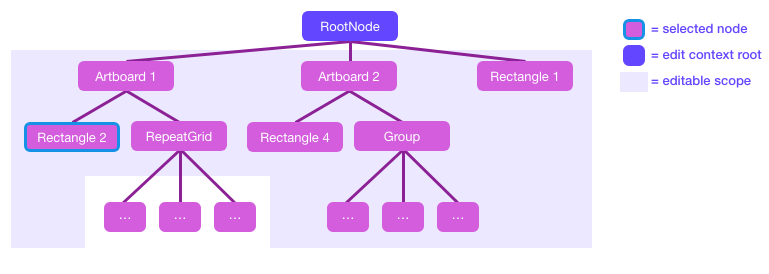

---
keywords:
  - Creative Cloud
  - API Documentation
  - UXP
  - Plugin
---

# Edit context rules

The **edit context** is the scope within which your plugin is allowed to make edits or set the selection. It is a "neighborhood"
of scenegraph nodes around the user's current selection. To access the contents of many container nodes such as RepeatGrids or
SymbolInstances, the user must first drill down into the container by double clicking or Cmd-clicking it (Ctrl-clicking on Windows).

Like nearly all commands in XD, your plugin is limited to making changes only within the scope of the current edit context.

_Note: these rules have changed in **XD 17**. If you intend to support XD 16 or earlier, follow the more restrictive edit context rules
described in [the previous version of these docs](https://github.com/AdobeXD/plugin-docs/blob/XD16/reference/core/edit-context/)._

The current edit context's scope is derived from the current selection:

- The **"edit context root"** is the node which is the closest common ancestor of all the selected nodes. It's typically indicated
  by a  in the UI:

  As a special case, if the edit context root would be an Artboard, it is moved up to the root of the entire scenegraph instead.

- Nodes within this subtree are "in scope" for editing (or selection) _if_ they are connected to the edit context root by a parent
  chain consisting entirely of plain Groups or Artboards. (A "plain Group" is a Group node with no [mask](../scenegraph/#Group-mask)).

- You can always safely assume that all selected nodes are in scope for editing.

### Examples

_**Scenario 1:**_ The user has selected two items inside a Group.

The Group is the edit context root, and all its children are within scope for editing. In addition, if any of those children are nested
Groups, their children are also in scope for editing (recursively, if any of those are Groups too).

If any of the children are a different container type, however, the edit scope does not include that node's children:

_**Scenario 2:**_ The user has selected two items, each inside different Groups.

The edit context root is Group 1, the closest common ancestor of the selected items. In this case, all nodes in the subtree of Group 1 are
in scope for editing, but if this subtree contained any non-Group containers, their children would be off limits (as in the second example
in Scenario 1).

_**Scenario 3:**_ The user has selected one item that is an immediate child of an Artboard.

Per the special case noted above, the edit context root is the root of the entire document (the scenegraph's RootNode). This is true
any time the user hasn't drilled into a particular container. The editable scope encompasses -- at _minumum_ -- all Artboards, all
other immediate children of the root node (aka the pasteboard), and all immediate children of _all_ artboards (not just the one
containing the selection). If any of those nodes is a plain Group, its children are also in scope for editing (recursively, if any
of those are Groups too).

### What changes are allowed within the edit context?

**Simple changes** can be made directly to the scenegraph nodes that are in scope:

- Change a property
- Delete a node
- Add a new _leaf node_ (basic shape node)

**Structural changes** _cannot_ be made directly, since their impact extends to nodes outside the edit context's scope. You can make
structural changes by scripting XD commands:

- Ungroup (or break apart other container types) - use the [`ungroup()` command](/develop/reference/commands/#module_commands-ungroup)
- Create new Groups (add a whole _tree_ of new nodes) - use the [`group()` command](/develop/reference/commands/#module_commands-group)
- Rearrange Z order - use commands such as [`bringToFront()`](/develop/reference/commands/#module_commands-bringToFront)

If a plugin breaks any of these rules, its entire edit operation will be reverted to protect the user's document from corruption.

### Exceptions to these rules

- You can set [`pluginData`](../scenegraph/#SceneNode-pluginData) on the root node of the scenegraph regardless of the current edit
  context, making it useful for storing plugin settings that are document-specific.
- The RepeatGrid APIs [`attachTextDataSeries()`](../scenegraph/#RepeatGrid-attachTextDataSeries) and [`attachImageDataSeries()`](../scenegraph/#RepeatGrid-attachImageDataSeries) can be called when _either_ the RepeatGrid node _or_ the target node being
  attached to is in the current edit context.
