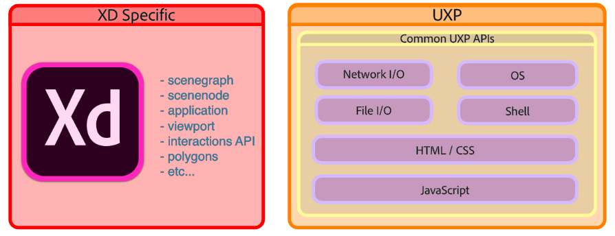

# API References

There are two main types of APIs you can use to create your XD plugin. While Unified Extensibility Platform (UXP) provides commonly used APIs across different Creative Cloud applications, Host APIs enable developers to extend XD specific features.

- [UXP APIs](/reference/uxp/index/)
- [Host APIs](xd-index/)

For more information on how UXP and host APIs work together, refer to [Accessing APIs](/reference/core/apis/).

Read ["How to read the reference documentation"](/reference/how-to-read/) to learn how to read symbols inside the docs.