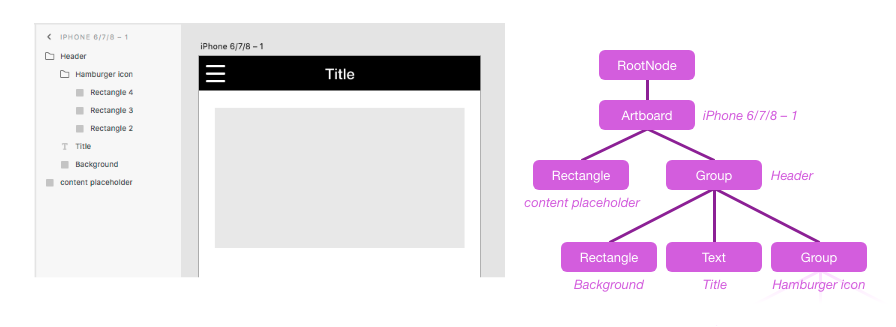

---
keywords:
  - Creative Cloud
  - API Documentation
  - UXP
  - Plugin
---

# scenegraph

The scenegraph is a node tree which represents the structure of the XD document. It closely matches the hierarchy seen in the Layers panel
inside XD. Some scenenodes may contain children (e.g., a Group or Artboard), while others are leaf nodes (e.g., a Rectangle or Text node).
The root of the scenegraph contains all Artboards that exist in the document, as well as all _pasteboard_ content (nodes that are not
contained by any artboard).



You can modify properties on any scenenodes within the current [_edit context_](/develop/plugin-development/xd-concepts/edit-context/),
and add leaf nodes to the current edit context, but you cannot make structural changes directly to the scenegraph tree. Instead, use
[commands](/develop/reference/commands/).

Typically, you access scenegraph nodes via the [selection](/develop/reference/selection/) argument that is passed to your plugin command, or by
traversing the entire document tree using the [documentRoot](/develop/reference/RootNode) argument that is passed to your plugin command. These
objects are also accessible on the scenegraph module for convenience.

**Example**

```js
function myCommand(selection) {
  let node = selection.items[0];

  console.log("The selected node is a: " + node.constructor.name);

  // Print out types of all child nodes (if any)
  node.children.forEach(function (childNode, i) {
    console.log("Child " + i + " is a " + childNode.constructor.name);
  });
}
```

To create new scenenodes, load this `scenegraph` module directly and use the node constructor functions:

**Example**

```js
let scenegraph = require("scenegraph");
function myCommand(selection) {
  let newShape = new scenegraph.Rectangle();
  newShape.width = 100;
  newShape.height = 50;
  newShape.fill = new Color("red");
  selection.insertionParent.addChild(newShape);
}
```

## Class hierarchy

> **Tip**
> Additional subclasses may be added in the future. Always be sure to have a default case for unknown scenenode classes
> when traversing the scenegraph.

- [SceneNode](/develop/reference/SceneNode)
  - [GraphicNode](/develop/reference/GraphicNode)
    - [Artboard](/develop/reference/Artboard)
    - [Rectangle](/develop/reference/Rectangle)
    - [Ellipse](/develop/reference/Ellipse)
    - [Polygon](/develop/reference/Polygon)
    - [Line](/develop/reference/Line)
    - [Path](/develop/reference/Path)
    - [BooleanGroup](/develop/reference/BooleanGroup)
    - [Text](/develop/reference/Text)
  - [Group](/develop/reference/Group)
  - [SymbolInstance](/develop/reference/SymbolInstance)
  - [RepeatGrid](/develop/reference/RepeatGrid)
  - [ScrollableGroup](/develop/reference/ScrollableGroup)
  - [LinkedGraphic](/develop/reference/LinkedGraphic)
  - [RootNode](/develop/reference/RootNode)

## Typedefs

### Typedef Point
- Point: `{x:number, y:number}`

### Typedef Bounds
- Bounds: `{x:number, y:number, width:number, height:number}`

## selection

▸ **selection**: [selection](/develop/reference/selection)

**Since**: XD 14

Object representing the current selection state and [edit context](/develop/plugin-development/xd-concepts/edit-context/). Also available as the first argument passed to your plugin command handler function.

**Kind**: static property of [scenegraph](#scenegraph)
**Read only**: true

## root

▸ **root**: [RootNode](/develop/reference/RootNode)

**Since**: XD 14

Root node of the current document's scenegraph. Also available as the second argument passed to your plugin command handler function.

**Kind**: static property of [scenegraph](#scenegraph)
**Read only**: true

## getNodeByGUID()

▸ **getNodeByGUID**(`guid`): [SceneNode](/develop/reference/SceneNode)

**Since**: XD 28

Returns the scenenode in this document that has the given [node GUID](/develop/reference/SceneNode/#guid). Returns undefined if no such node exists connected
to the scenegraph tree (detached/orphan nodes will not be found). This provides a fast way of persistently remembering a node across plugin
operations and even across document open/closes.

| Param | Type   | Description                                                                                   |
| ----- | ------ | --------------------------------------------------------------------------------------------- |
| guid  | string | SceneNode GUID -- must be all lowercase, as returned by the [guid getter](/develop/reference/SceneNode/#guid) |

**Example**

```js
let node = scenegraph.selection.items[0];
let guid = node.guid;

// ...later on:
let sameNode = scenegraph.getNodeByGUID(guid);
if (sameNode) {
  // ^ Always check if node still exists - user may have deleted it
  console.log("Found node again!", sameNode);
}
```

**Kind**: static method of [scenegraph](#scenegraph)
