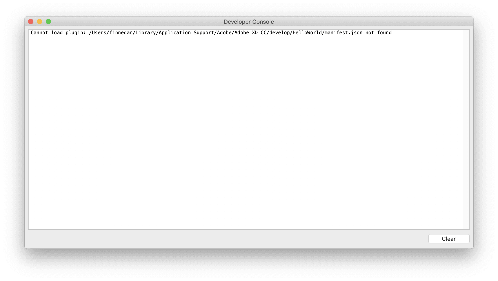

---
keywords:
  - Creative Cloud
  - API Documentation
  - UXP
  - Plugin
---

# How to Debug Your Plugin

Bugs happen! In this tutorial, you will learn how to debug your Adobe XD plugin.

### Prerequisite

At least one plugin created and added to the [UXP Developer Tool](/develop/plugin-development/devtool).

### Debugging Options

To debug your Adobe XD plugins, you'll be using the [UXP Developer Tool](/develop/plugin-development/devtool). However, you can glean some useful information by using the built-in Developer Console provided by Adobe XD. (Note that this is a legacy feature and _will_ be going away in the future.)

## Debugging with the UXP Developer Tool

### 1. Load your plugin

1. If you haven't already, launch the [UXP Developer Tool](/develop/plugin-development/devtool) application.
2. Next to the plugin you want to debug, find the **•••** button and click it. Select **Load** to load this into XD.

### 2. Launch Debugger

1. Click **••• > Debug**. This will launch a Chrome Developer Tools environment that you can use to debug your plugins.

### What works, what doesn't

Currently, you **can**...

- Set breakpoints, pause & step through code, inspect the values of variables
- View objects and run code in the Console view
- View and edit the DOM structure of your plugin's UXP UI
- View networking requests (for XHR, `fetch`, and Websockets only)

**Important caveats:**

- XD may be unstable while debugging a plugin. Don't debug when you have important XD documents open.
- Error messages are often _missing_ from the DevTools Console. Use the Developer Console within XD to be sure you are not missing any important information.
- XD will be partially frozen while paused on a JS breakpoint. Don't try to interact with XD while paused.
- You may see a blank white panel to the left of the DevTools UI. Ignore this, as it does nothing.
- If debugging exposes any private fields and methods, do not attempt to use them. Plugins referring to private APIs may be rejected or removed from the plugin marketplace.

## Quick debugging with Developer Console

### 1. Check the Developer Console

In XD, click _Plugins > Development > Developer Console (Legacy)_.

This displays information similar to what you'd find in the JS debugger's console view:

- Any `console.log()` output from your plugin
- Any error messages from XD due to plugin misbehavior, or failure to load a plugin
- Stack traces if your code throws an uncaught exception

The console output for _all_ installed XD plugins is mixed together in one single view here.

### 2. Reload your plugin after making fixes

**Note:** The `develop` folder can be used during plugin development, and is the only folder XD will reload plugins from when you reload plugins from the _Plugins_ menu. XD makes it very easy for you to get to the `develop` folder: simply go to this menu item: Plugins > Development > Show Develop Folder.

You can easily iterate on your plugin code without having to restart XD. Switch to the UXP Developer Tool, and click _Actions > Reload All_, which will force the developer tool to reload all loaded plugins.

There's also a handy keyboard shortcut in the UXP Developer Tool to make reloading easier:

| Platform | Keyboard shortcut |
| -------- | ----------------- |
| macOS    | Shift-Cmd-R       |
| Windows  | Ctrl-Shift-R      |

If there are any errors blocking the plugin from loading, they will appear in the Developer Console on reload:

