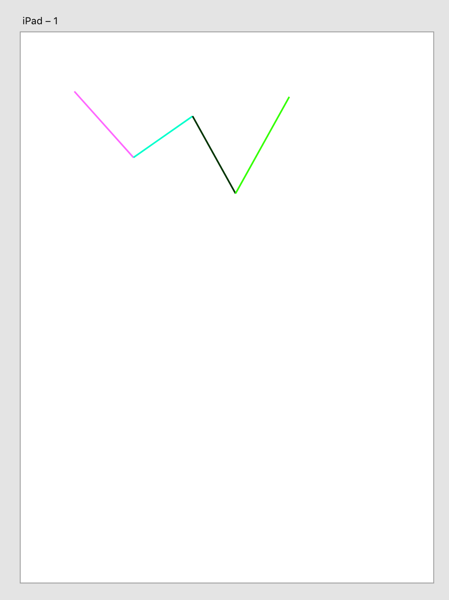

# How to draw lines

This sample demonstrates how to create a plugin that adds colored lines to the user's document.

## Prerequisites

- Basic knowledge of HTML, CSS, and JavaScript
- [Quick Start Tutorial](/tutorials/quick-start/)
- [Debugging Tutorial](/tutorials/debugging/)

## Development Steps

> **Info**
> Complete code for this plugin can be found [on GitHub](https://github.com/AdobeXD/Plugin-Samples/tree/master/how-to-draw-lines).

### 1. Prepare your plugin scaffold

First, edit the manifest file for the plugin you created in our [Quick Start Tutorial](/tutorials/quick-start/).

Replace the `uiEntryPoints` field of the manifest with the following:

```json
"uiEntryPoints": [
    {
        "type": "menu",
        "label": "Create lines",
        "commandId": "createLinesCommand"
    }
]
```

If you're curious about what each entry means, [see the manifest documentation](/develop/plugin-development/plugin-structure/manifest/), where you can also learn about all manifest requirements for a plugin to be published in the XD Plugin Manager.

Then, update your `main.js` file, mapping the manifest's `commandId` to a handler function.

Replace the content of your `main.js` file with the following code:

```js
function createLinesCommand(selection) {
  // The body of this function is added later
}

module.exports = {
  commands: {
    createLinesCommand,
  },
};
```

The remaining steps in this tutorial describe additional edits to the `main.js` file.

### 2. Require in XD API dependencies

For this tutorial, we just need access to two XD scenegraph classes and one XD module.

Add the following lines to the top of your `main.js` file:

```js
// Add this to the top of your main.js file
const { Line, Color } = require("scenegraph");
const commands = require("commands");
```

Now the `Line` and `Color` classes and `commands` module are required in and ready to be used.

### 3. Create a helper function

Our plugin is going to assigning random colors to the lines we create!

Add the lines of code below to your file:

```js
function randomColor() {
  const hexValues = ["00", "33", "66", "99", "CC", "FF"];
  const color =
    "#" +
    Array.from(
      { length: 3 },
      (_) => hexValues[Math.floor(Math.random() * hexValues.length)]
    ).join("");
  return color;
}
```

This function returns a web-friendly color hex value (e.g., `"#FFFFFF"). This is just straight-up JavaScript; there's nothing specific to XD plugin APIs to cover here.

### 4. Create line data

In this step, we're going to add a little more plain-old JavaScript. This time we'll add a data structure that will set us up to draw lines with the XD plugin API in the next step.

Add this code to your file:

```js
const lineData = [
  { startX: 100, startY: 110, endX: 210, endY: 233 },
  { startX: 210, startY: 233, endX: 320, endY: 156 },
  { startX: 320, startY: 156, endX: 400, endY: 300 },
  { startX: 400, startY: 300, endX: 500, endY: 120 },
];
```

A couple of things to note:

- In this example, the each line's `startX` and `startY` matches the former line's `endX` and `endY`. This ensures lines are connected to each other. But they don't _have_ to connect; feel free to modifiy the data as you wish!
- The data structure here is important to note:
  - `lineData` is an array. This gives us a way to store coordinates for multiple lines. We'll loop over this array in the next step.
  - The array contains multiple objects that will be passed, one at a time, to the `Line` API.
  - Since we're drawing lines, each object has a _start_ and _end_ coordinates for X and Y.

### 5. Create the main function

In this step, we'll build out the main function, `createLinesCommand`, that we added in the first step. Each of the numbered comments are explained below the code:

```js
function createLinesCommand(selection) {
  // [1]

  let lines = []; // [2]

  lineData.forEach((data) => {
    // [3]
    const line = new Line(); // [4.i]

    line.setStartEnd(
      // [4.ii]
      data.startX,
      data.startY,
      data.endX,
      data.endY
    );

    line.strokeEnabled = true; // [4.iii]
    line.stroke = new Color(randomColor()); // [4.iv]
    line.strokeWidth = 3; // [4.v]

    lines.push(line); // [4.vi]

    selection.editContext.addChild(line); // [4.vii]
  });

  selection.items = lines; // [5]
  commands.group(); // [6]
}
```

1. This function only needs the first [contextual argument](/develop/plugin-development/plugin-structure/handlers/#contextual-arguments), `selection`, which gives access to the selection object inside XD.
2. Create an empty array to contain all the `Line` objects we'll create. This array will be used in a later step.
3. Loop over the `lineData` array, getting an individual `data` object each time through the loop.
4. For each `data` object:
   1. Create a new instance of `Line`.
   1. Use the `Line` object's setter, `.setStartEnd`, to set the line data from our `data` object.
   1. Set the `strokeEnabled` property to `true` in order to draw a stroke for the line.
   1. Set the stroke color using the `randomColor` helper function.
   1. Set the width of the stroke using `strokeWidth` property.
   1. Append the line object into the `lines` array.
   1. Insert the line into the edit context using the `selection.editContext.addChild` method. This step adds the line to the document's scenegraph.
5. Now that all of the `Line` objects have been added to the scenegraph, set the document's current selection to be those `Line` objects.
6. Use the `group` command to combine all of the currently-selected objects (the `Line` objects) into a single group object.

### 6. Run the plugin

After saving all of your changes, reload the plugin in XD and run it. The result should be similar to the following:


