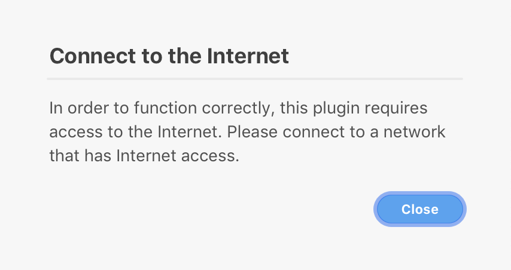
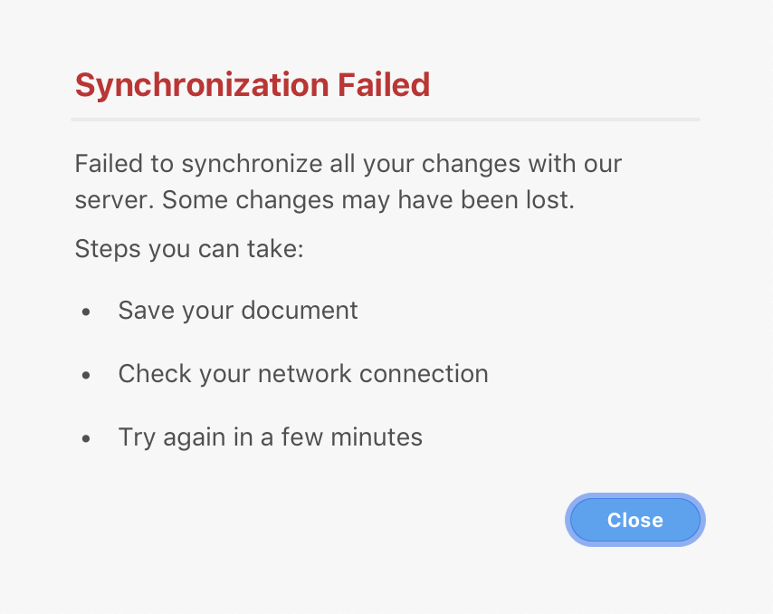

# How to show an alert

There will be times when you need to show a simple message to your user. This tutorial will show you an easy way to display an informational message like the following:



Other times you'll need to display an _error_ alert, which looks like this:



## Technology Used
- [Plugin Toolkit](https://github.com/AdobeXD/plugin-toolkit)

## Prerequisites
- Basic knowledge of HTML, CSS, and JavaScript.
- [Quick Start Tutorial](/tutorials/quick-start/)
- [Debugging Tutorial](/tutorials/debugging/)

## Development Steps

> **Info**
> Complete code for this plugin can be found [on GitHub](https://github.com/AdobeXD/plugin-samples/tree/master/how-to-display-an-alert).

### 1. Prepare your manifest.json file

First, edit the manifest file for the plugin you created in our [Quick Start Tutorial](/tutorials/quick-start).

Replace the `uiEntryPoints` field of the manifest with the following:

```json
"uiEntryPoints": [
    {
      "type": "menu",
      "label": "How to show an alert",
      "commandId": "showAlert"
    },
    {
      "type": "menu",
      "label": "How to show an error",
      "commandId": "showError"
    }
  ]
```

If you're curious about what each entry means, [see the manifest documentation](/reference/structure/manifest/), where you can also learn about all manifest requirements for a plugin to be published in the XD Plugin Manager.

### 2. Add the "plugin helpers" library

Creating dialogs can take a lot of boilerplate code, but we've created a small library that makes it simple to display simple dialogs in the form of a "helper" library. This library is located at https://github.com/AdobeXD/plugin-toolkit.

To add the library to your project, you can:

* Click the "Clone or Download" button on the right side of the page
* Uncompress the zip file after the download completes
* Copy the `lib` folder to your plugin project

### 3. Require the `dialogs` module in `main.js`

Add the following to your `main.js`:

```js
const { alert, error } = require("./lib/dialogs.js");
```

This will import a `alert` function that we can call to display an alert. The `error` function can be used to display the error variation.

### 4. Create a function to display the alert

```js
async function showAlert() {
	/* we'll display a dialog here */
}
```

Next, inside this function, we call `alert` to render the message. This function takes several parameters:

1. The dialog's title
2. The text you want to display to the user in the dialog's body -- you can pass as many lines of text as you want (but be careful: dialogs won't scroll automatically!)

Let's see what that looks like in code:

```js
await alert("Connect to the Internet", //[1]
    "In order to function correctly, this plugin requires access to the Internet. Please connect to a network that has Internet access."); //[2]
```

### 5. Create a function to display an error alert

```js
async function showError() {
	/* we'll display a dialog here */
}
```

Inside this function, we call `error` to render the message. Just like `alert`, this function takes several parameters:

1. The dialog's title
2. The text you want to display to the user in the dialog's body -- you can pass as many lines of text as you want (but be careful: dialogs won't scroll automatically!)

Let's see what that looks like in code:

```js
await error("Synchronization Failed", //[1]
    "Failed to synchronize all your changes with our server. Some changes may have been lost.",
    "Steps you can take:",
    "* Save your document",
    "* Check your network connection",
    "* Try again in a few minutes"); //[2]
```

Note that the we passed several lines of text to `error`, including some markdown-like list items. The `dialogs` module understands a very limited subset of markdown; for more see the [Plugin Toolkit](https://github.com/AdobeXD/plugin-toolkit).

### 6. Create the menu handler

We need to export a menu handler from the `main.js` file so that XD knows what to do with our plugin:

```js
module.exports = {
    commands: {
        showAlert,
        showError
    }
}
```
Make sure to your commands match the manifest's `commandId`s written in the first step.

## Guidelines

It's important to know _when_ to show an alert because they do obstruct the user's ability to interact with XD. As such, you should follow these guidelines:

* **Don't** display "success" alerts when it's obvious that the plugin has been successful.
* **Do** display a "success" alert if your plugin's operation is completed, but the user would have no way of knowing.
* **Do** use human-readable language.
* **Don't** use technical jargon unless it's language the user is already familiar with.

## Next Steps

Other than `alert` and `error`, there are other useful dialog helpers that you might be interested in.

- [How to ask for confirmation](/tutorials/how-to-ask-user-for-confirmation/)
- [User Interface design](/design/user-interface/)
- [Other samples](https://github.com/AdobeXD/plugin-samples)
