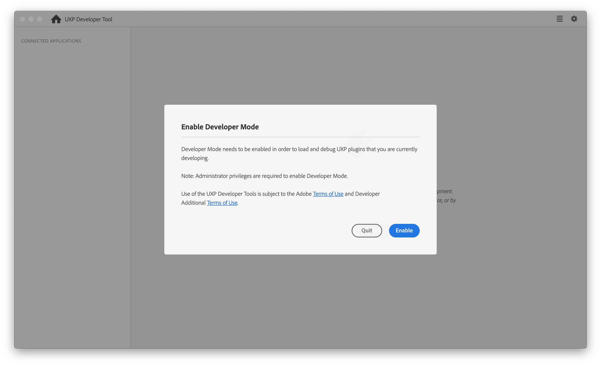

# Installation

Once you download the UXP Developer Tool, you can install it by following these steps.

## For macOS

<InlineAlert variant="help" slots="text"/>

Note that the UXP Developer Tool supports macOS 10.13.6 or better. You'll also need rights to approve elevated permissions requests, or the Tool will not function correctly.

* Open the `.dmg` file you downloaded.
* The disk image should open automatically.
* Double-click `Install.app`
* The installation process will proceed automatically.
* When installation is complete, you'll be asked if you wish to **Close** the installer, or **Launch** the Developer Tool. Either option is acceptable.

Now that the Developer Tool is installed, you can launch it from the Launchpad, Spotlight, or from the Applications folder. 

## For Windows

<InlineAlert variant="help" slots="text"/>

Note that the UXP Developer Tool requires Windows 10 or better. You'll also need rights to approve elevated permissions requests, or the Tool will not function correctly.

<InlineAlert variant="warning" slots="text"/>

Your installation of Windows 10 must be in Developer mode. If it isn't, the Tool may not work correctly.

* Extract the contents of the `.zip` file you downloaded into a temporary location.
* Double-click the `Set-up.exe` file.
* The installation process will proceed automatically.
* When installation is complete, you'll be asked if you wish to **Close** the installer, or **Launch** the Developer Tool. Either option is acceptable.

Now that the Developer Tool is installed, you can launch it from the Start Menu or Windows Search.

## Launching for the first time

When you launch the Developer Tool for the first time, you'll be prompted to enable Developer Mode. This is required in order for you to load plugins in development into Photoshop.



Once you click `Enable`, elevated permissions will be requested, and you may be required to enter your password or approve an action from the Developer Tool.


If you have problems with this step, you can also configure Developer Mode manually, although you must have Administrative privileges to do so:

* Quit the UXP Developer Tool
* Navigate to `/Library/Application Support/Adobe/UXP/Developer` on macOS, or `%CommonProgramFiles%/Adobe/UXP/Developer` on Windows. (If the folder does not exist, you can create it -- you'll need administrative rights.)
* Create a new file named `settings.json` with the following contents (You'll need administrative rights to save the file):
    ```json
    {"developer" : true}
    ```
* Launch the UXP Developer Tool again.


